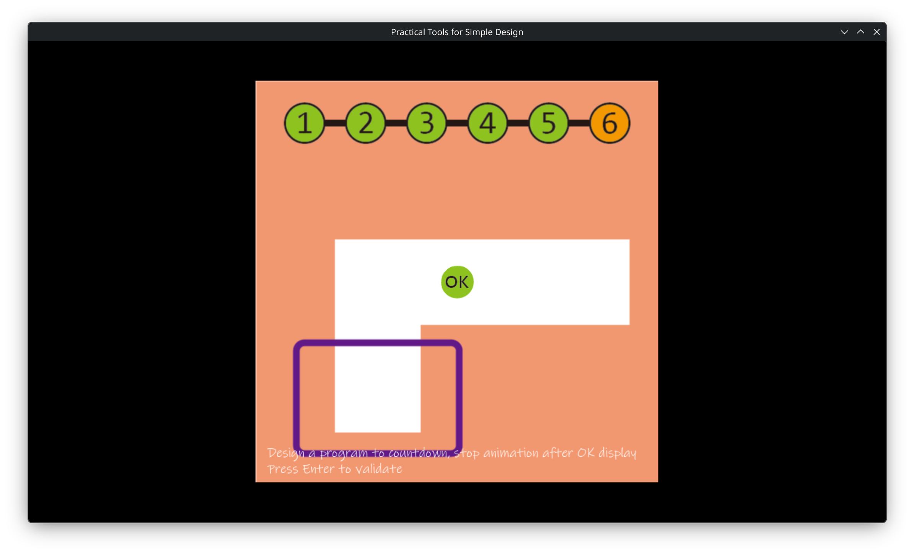
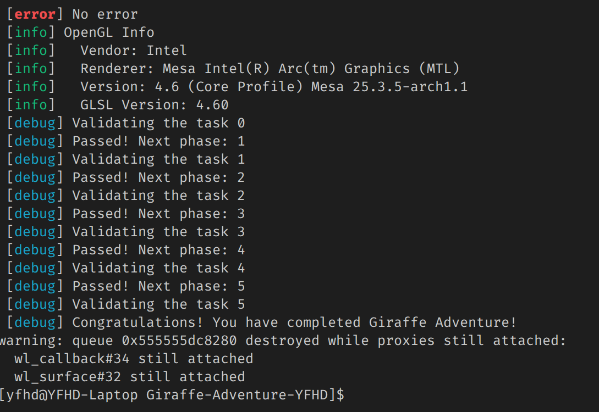
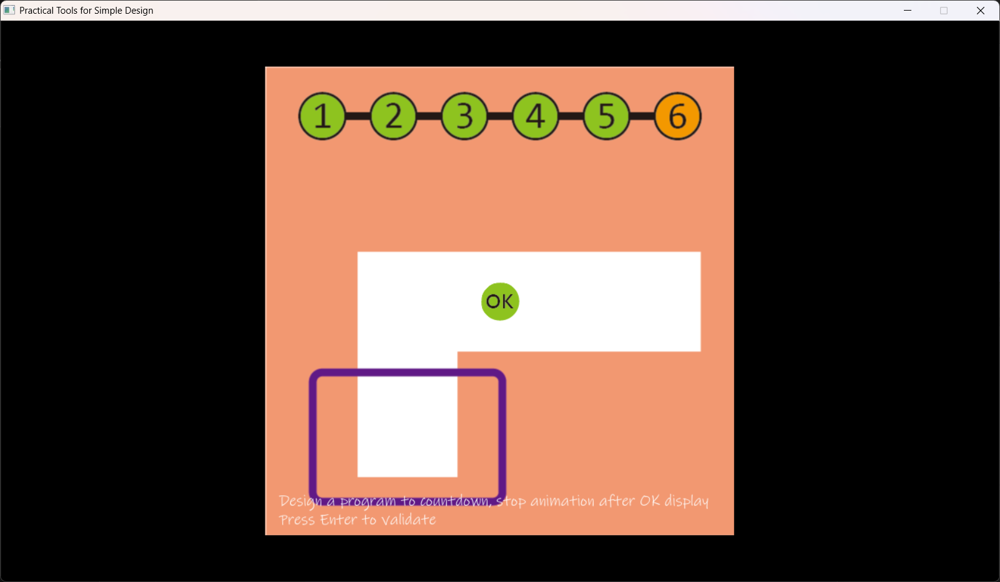
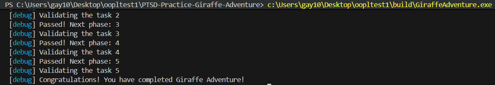

# Abstract
遊戲名稱：元氣騎士

組員：
- 111590021 邱冠勛
- 113590049 朱政全

# Game Introduction
### 遊戲內容與簡介
一款 2D 的槍枝攻擊涉及遊戲，具備豐富的怪物種類與刺激的戰鬥關卡，多樣性的互動提供新鮮感，是個奇幻風冒險單機遊戲。

### 期望完成的內容
- [ ] 遊玩 HUD
- [ ] 遊戲主選單
- [ ] 至少三個地圖
- [ ] 至少三種小怪
- [ ] 至少三個 Boss
- [ ] 一把可以攻擊的武器
- [ ] 角色與地圖物件的碰撞檢測

### 《元氣騎士》影片

# Development timeline 

- Week 2：處理遊戲的封面
  - [ ] 蒐集遊戲的素材
  - [ ] 處理遊戲封面的素材
  - [ ] 進行遊戲封面的設計

- Week 3 ＆ Week 4：NPC AI 設計
  - [ ] 敵對 AI 系統
  - [ ] 友軍 AI 系統
  - [ ] 互動式 AI 系統

- Week 4 ＆ Week 5：地圖系統
  - [ ] 地圖管理系統
  - [ ] 地圖場景製作

- Week 6 ＆ Week 7：碰撞檢查
  - [ ] 實作碰撞檢查函式
  - [ ] 實作物體碰撞箱
 
- Week 8 ＆ Week 9：武器系統實作
  - [ ] 槍支類武器
  - [ ] 刀類武器 

- Week 10 ＆ Week 11：特殊攻擊方式
  - [ ] 怪物大招製作
  - [ ] 玩家大招製作

- Week 12 ＆ Week 13：Galgame 系統架構
  - [ ] 對話系統

- Week 14 ＆ Week 15：交易系統
  - [ ] 交易介面實作

- Week 16 ＆ Week 17：Quality Control
  - [ ] 測試遊戲漏洞

# PTSD Girafee Adventure 通關證明
### 111590021 邱冠勛
| 遊戲畫面 | 終端機輸出 |
| :---: | :---: |
|  |  |

### 113590049 朱政全
| 遊戲畫面 | 終端機輸出 |
| :---: | :---: |
|  |  |